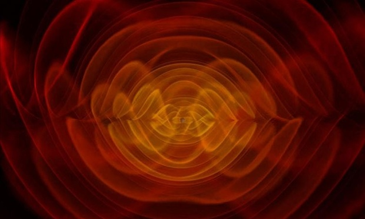

# Gravitational Waves

Physicists have announced the discovery of gravitational waves, ripples in the fabric of spacetime that were first anticipated by Albert Einstein a century ago.

The detection of gravitational waves not only confirms Einstein's general theory of relativity, it amounts to the first direct detection of a pair of colliding black holes, the mysterious structures in space that are so dense they exert a gravitational force from which nothing - not even light - can escape.

[Sound of the Gravity](./ligo-chirp.mp3).

